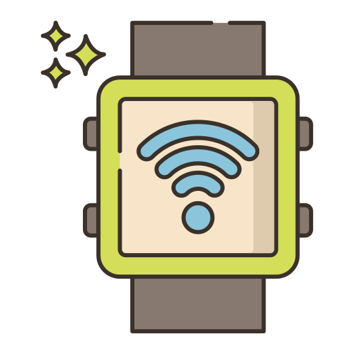

# Smartwatch
Open Projects 2021
## Abstract  

This smartwatch project is a step towards exploring what is Arduino and how it works. A Smartwatch functions both as a watch as well as a miniature size smart phone with limited features. This project was designed and simulated entirely in the online mode using various softwares to draw the schematic and simulate it (Proteus), work on the PCB layout (Easy EDA) and finally do a casing for the smartwatch (solidworks). This watch can be connected to mobile via Bluetooth and it can respond to the commands given via Bluetooth and can also monitor the notifications that we receive in our mobile. Apart from this, it can also show the day-date-time info like a normal digital watch and can also show us the temperature of the medium in which it is kept.  

